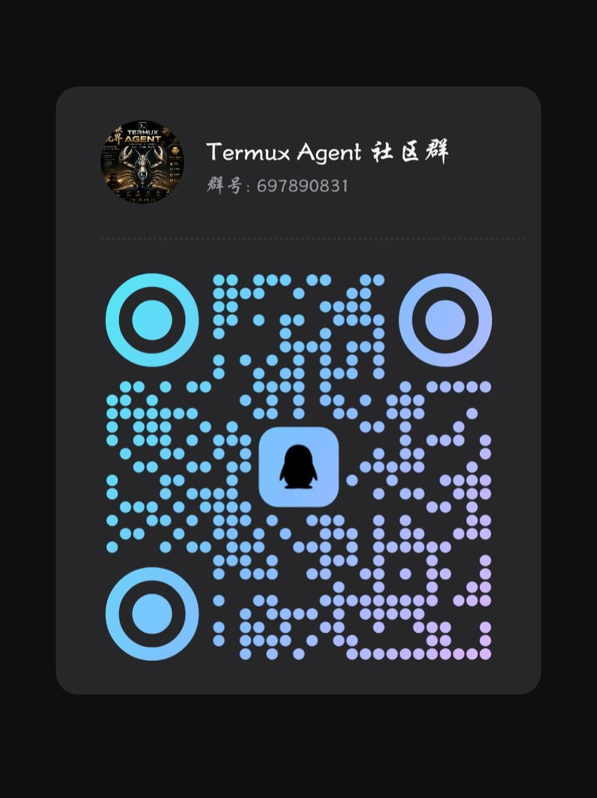

# 🦊 HANGAIJIN — Run OpenClaw on Android

[中文](README.md)

<div align="center">


</div>

> 🚀 **One command** to run OpenClaw AI agents on your Android phone.
> No proot, no Linux distro — just Termux.

---

## ⚡ Quick Start

```bash
curl -sL https://raw.githubusercontent.com/HANPU5838/HANGAIJIN/main/bootstrap.sh | bash
```

Copy and paste the command above into Termux and let it run.

---

## ✨ Features

| | | |
|:---:|---|---|
| 🚀 | **One-Click Install** | Fully automated — no manual setup, no compilation |
| 📱 | **Native Execution** | Runs directly in Termux — no proot, no chroot, no container |
| ⚡ | **Zero Overhead** | glibc compatibility layer + grun wrapper, native binary performance |
| 🔧 | **Highly Extensible** | Plugin system for custom tools, skills, and workflows |
| 🛡️ | **Platform-Aware** | Auto-detects CPU architecture, auto-selects mirror sources |
| 🧠 | **Multi-Model** | Claude, Gemini, Codex — switch AI backends freely |

---

## 📋 System Requirements

| Item | Minimum | Recommended |
|------|---------|-------------|
| Android | 7.0 (API 24) | 12+ (API 31+) |
| Architecture | arm64-v8a | aarch64 |
| RAM | 2 GB | 4 GB+ |
| Storage | 1 GB free | 4 GB+ free |
| Termux | Latest from F-Droid | Latest from F-Droid |

---

## 🛡️ Permissions

**No root access required.** All operations run within Termux's user space:

| Permission | Type | Purpose |
|-----------|------|---------|
| 🌐 Network | Normal | Download packages & dependencies |
| 📡 Foreground Service | Normal | Keep agent running in background |
| 🔋 Ignore Battery Optimization | Normal | Prevent background kill (optional) |
| ⚡ Wake Lock | Normal | Keep device awake |
| 🔄 Boot Completed | Normal | Auto-restart after reboot |
| 💾 Storage | Normal | Store configs & model data |
| 📜 Script Execution | Normal | `chmod +x` only |

---

## 🏗️ Architecture

A **3-tier decoupled architecture** for running Linux binaries natively on Android:

```
┌──────────────────────────────────────────────┐
│  L3 Application                              │
│  OpenClaw · CLI Tools · AI Coding Assistants  │
├──────────────────────────────────────────────┤
│  L2 Runtime                                  │
│  glibc Compatibility · Node.js v22 LTS        │
├──────────────────────────────────────────────┤
│  L1 Infrastructure                           │
│  System Deps · Mirror Auto-Detect · SSL Certs │
└──────────────────────────────────────────────┘
```

### Key Technical Details

- **glibc Compatibility Layer**: Uses `ld.so` direct execution (no patchelf), avoiding Android's seccomp restrictions
- **`glibc-compat.js` Patch**: Fixes `os.cpus()`, `os.networkInterfaces()` and other API incompatibilities
- **Mirror Auto-Detection**: Automatically detects reachable GitHub / npm mirrors
- **Android 12+ Support**: Detects phantom process killer and provides mitigation guidance

---

## 🧩 Components

| Component | Type | Description |
|-----------|------|-------------|
| 🧠 **OpenClaw Core** | Required | AI agent engine with multi-model support, tool calling, memory mgmt |
| 📦 **Node.js** | Required | Linux-arm64 v22 LTS with glibc wrapper |
| 🔗 **glibc Layer** | Required | Linux binary execution via `ld-linux-aarch64.so.1` |
| 🌐 **Chromium** | Optional | Browser automation engine (~400 MB) |
| 💻 **code-server** | Optional | VS Code in the browser |
| 🖥️ **tmux** | Optional | Terminal multiplexer |
| 🌍 **ttyd** | Optional | Web-based terminal |
| 📁 **dufs** | Optional | Lightweight file server |
| 🔧 **android-tools** | Optional | ADB debugging tools |
| 🤖 **Claude / Gemini / Codex** | Optional | AI coding CLI tools |

---

## 🎮 Usage

After installation, manage with OpenClaw official commands:

```bash
openclaw gateway start     Start the OpenClaw gateway
openclaw gateway stop      Stop the OpenClaw gateway
openclaw gateway restart   Restart the OpenClaw gateway
openclaw gateway status    Check running status
openclaw onboard           Initialize & configure your agent
openclaw update            Update OpenClaw core
openclaw backup            Backup your configuration
```

---

## ⚙️ Configuration

Edit files under `~/.hangaijin/workspace/agents/main/agent/` to customize your agent's personality, tools, and memory system.

---

## 📚 Documentation

### Installation Directory Layout

```
~/.hangaijin/
├── bin/                # grun wrapper scripts
├── node/               # Node.js runtime
├── patches/            # Compatibility patches
├── platforms/          # Platform-specific config
├── scripts/            # Utility scripts
└── .platform           # Platform marker file
```

### FAQ

**Q: Background processes killed on Android 12+?**
A: See the [phantom process killer guide](docs/disable-phantom-process-killer.md).

**Q: `openclaw` command not found after installation?**
A: Run `source ~/.bashrc` to reload the environment, or restart Termux.

**Q: What does the glibc layer do?**
A: Android uses Bionic libc (non-standard), while OpenClaw requires glibc. This project uses `ld-linux-aarch64.so.1` + wrapper scripts to run Linux binaries without patchelf or chroot.

---

## 👥 Join the Community

<div align="center">
  <table>
    <tr>
      <td align="center">
        
        <br/>
        <strong>🐧 QQ Group</strong>
        <br/>
        <em>Discussion & Feedback</em>
      </td>
      <td align="center">
        
        <br/>
        <strong>✈️ Telegram</strong>
        <br/>
        <em>Core Collaboration</em>
      </td>
      <td align="center">
        
        <br/>
        <strong>🎙️ QQ Channel</strong>
        <br/>
        <em>Announcements & Events</em>
      </td>
    </tr>
  </table>
</div>

---

## 📬 Contact

| Platform | Link / ID |
|----------|----------|
| ✈️ Telegram Channel | <https://t.me/xhgeievx> |
| 🟢 Tencent Channel | pd19613869 |
| 💬 QQ Group | 697890831 |

---

<div align="center">

*🦊 HANGAIJIN — Give every Android device an AI soul*

**MIT License** · © 2026 HANPU5838

</div>
