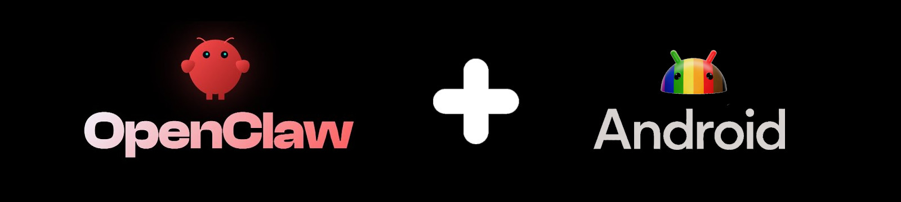

# 🦊 FoxTerm — Android 上的 OpenClaw

[English version](README.en.md)




> 一行命令在 Android 上运行 OpenClaw——不需要 proot，不需要 Linux 发行版，只需要 Termux。

## 快速开始

```bash
curl -sL https://raw.githubusercontent.com/HANPU5838/HAN/main/bootstrap.sh | bash
```

## 功能特点

- 🚀 **一键安装** — 无需手动配置，无需编译
- 📱 **原生运行** — 直接在 Termux 上运行，不需要 proot/chroot
- ⚡ **轻量高效** — 最小化资源占用，最大化性能
- 🔧 **可扩展** — 插件系统支持自定义工具和技能
- 🛡️ **平台感知** — 自动检测架构并进行优化

## 环境要求

- Android 7.0 及以上
- Termux（从 F-Droid 安装）
- 建议 2GB 及以上可用内存
- 1GB 及以上可用存储

## 包含组件

| 组件 | 说明 |
|------|------|
| OpenClaw 核心 | 智能体运行环境 |
| Chromium | 浏览器自动化引擎 |
| Node.js | JavaScript 运行时 |
| 可选工具 | tmux、code-server、ttyd、dufs、android-tools |

## 使用方法

安装完成后：

```bash
# 启动 OpenClaw
oa.sh start

# 停止 OpenClaw
oa.sh stop

# 更新
oa.sh update

# 查看状态
oa.sh status
```

## 自定义配置

编辑 `~/.openclaw/agents/main/agent/` 配置智能体的性格、工具和记忆。

---

*在 Android 设备上运行智能体。*

> 整合自网络公开项目。</details>
